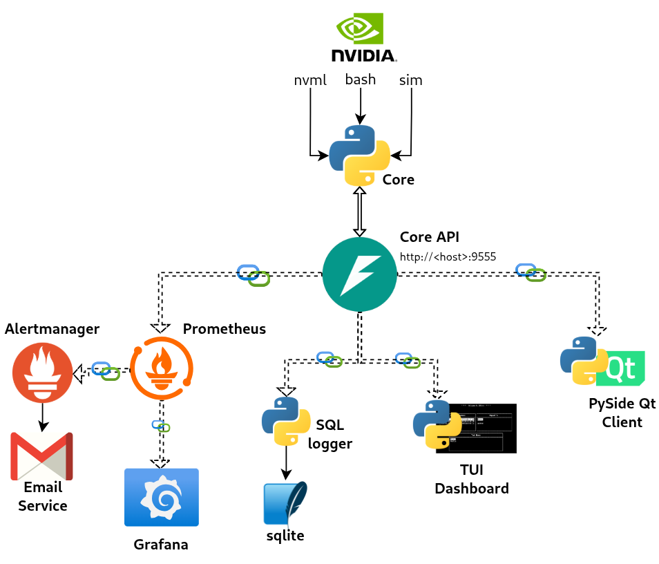

# پروژه شمارهٔ ۹ درس معماری کامپیوتر - سامانهٔ پایش منابع GPU

**ترم بهار ۱۴۰۴ - دکتر حسین اسدی**

**اعضای گروه**: امیرحسین محمدزاده، مهبد خالتی، امیرمهدی طهماسبی، مهدیار مستشار

**مسئول پروژه:** جناب آقای صداقت‌گو

---

## مقدمه

در این پروژه، هدف طراحی یک سامانهٔ هوشمند پایش (Monitoring) منابعِ کارت‌های گرافیکی (GPU - Graphical Processor Unit) بوده است که اهداف زیر را دنبال می‌کند:

- قابلیت **استخراج** Metric ها از سیستم (مانند GPU Utilization, Memory Usage, Temperature, Fan Speed و ...)
- قابلیت **ثبت** منظم داده‌های Metric در یک ساختار داده / پایگاه داده برای تحلیل‌های بعدی
- قابلیت **نمایش** لحظه‌ای و منظم وضعیت کارت/کارت‌های گرافیک 
  - تحت پنل وبی (Grafana)
  - تحت ترمینال (curses)
  - تحت دسکتاپ (‌pyside6)
- قابلیت **هشدار**؛ داخل پنل وبی و موارد مربوطه؛ و نیز **ارسال ایمیل** در صورت مداومت وضعیت مخاطره‌آمیز برای بیش از مدت مشخص
- ساختار مقیاس‌پذیر و قابلیت استفاده از راه دور 
- قابلیت پشتیبانی از چند GPU در یک سیستم

برای دستیابی به این اهداف، از یک ساختار منعطف و بر پایهٔ معماری میکروسرویس استفاده شد و همچنین تا حد ممکن از Docker استفاده شد. به‌طور خلاصه، این برنامه دارای یک هستهٔ استخراج‌کنندهٔ داده‌هاست (که بر اساس روش‌های مختلف `nvml` و `simulation` و نیز `bash` (که در واقع استفاده ترکیبی از `nvidia-smi` و `dcgmi` می‌باشد) داده را استخراج می‌کند)؛ و در کنار آن یک API Server که استفاده از داده‌های استخراج‌شده را به‌روش API Call ممکن می‌سازد. این معماری، برای فراهم‌آوردن امکان استفاده از راه دور، و نیز امکان استفاده از کانتینرهای docker برای بالاآوردن بخش‌های مختلف ابزار، لازم است.

## معماری پروژه 

معماری پروژه را در تصویر بالا مشاهده می‌کنید. همانطور که می‌بینید، پروژه از چند بخش اصلی تشکیل شده است:

- **بخش هستهٔ مرکزی** که در دایرکتوری `core/` فایل‌های آن را می‌بینید. با استفاده از دو فایل پایتون `core.py` (هستهٔ مرکزی با خروجی json برای استخراج داده‌های پایش با سه روش متفاوت) و `core_api.py` (سرور `FastAPI` شامل چند Endpoint برای استفاده از هستهٔ مرکزی به‌وسیلهٔ REST API) هندل می‌شود.
- **بخش مانیتورینگ و ثبت (Log) داده‌ها** که در دایرکتوری `logging-monitoring/` قرار دارد. این بخش، شامل سرویس Prometheus (برای جمع‌آوری خودکار داده‌ها و ثبت در داده‌ساختارهای Time-serie based و همچنین بررسی Rule ها و ...) و هندل‌کردن هشدارها توسط Alertmanager (ارسال ایمیل) و نیز یک کد ساده برای ثبت داده‌ها با فواصل زمان منظم در SQLite می‌باشد. البته نیازی به وجود آن نبود چون عملاً این‌کار را خود Prometheus انجام می‌دهد؛ ولی این را نیز پیاده کردیم که تجربهٔ ایجاد دستی فایلِ `.db` را نیز داشته باشیم (که با اسکریپت `csv_exporter.py` می‌توان خروجی csv نیز گرفت).
- **داشبورد Grafana** برای اتصال به Prometheus و مشاهده لحظه‌ای وضعیت و نیز لاگ‌های پیشین.
- **داشبورد تحت ترمینال** که بر پایهٔ کتابخانهٔ `curses` استوار است.
- **داشبورد گرافیکی دسکتاپ** که با استفاده از کتابخانهٔ `pyside6` پیاده‌سازی شده‌است.

## هسته مرکزی و API آن

## سرویس پایش، ثبت و هشدار

### استفاده از Prometheus

### تنظیم rule ها و کانفیگ alertmanager

### اسکریپت پایش دستی و ذخیره در Sqlite DB

## روش‌های نمایش و بررسی اطلاعات

### پنل وبی گرافانا (Grafana)

### نرم‌افزار پایتون تحت دسکتاپ (فریمورک pyside6)

### داشبورد TUI تحت ترمینال (بر پایهٔ curses) 

## بررسی ابزار DCGM

### معرفی DCGM

### مشکلات کار با  DCGM

### استفاده از DCGM

## جمع‌بندی

