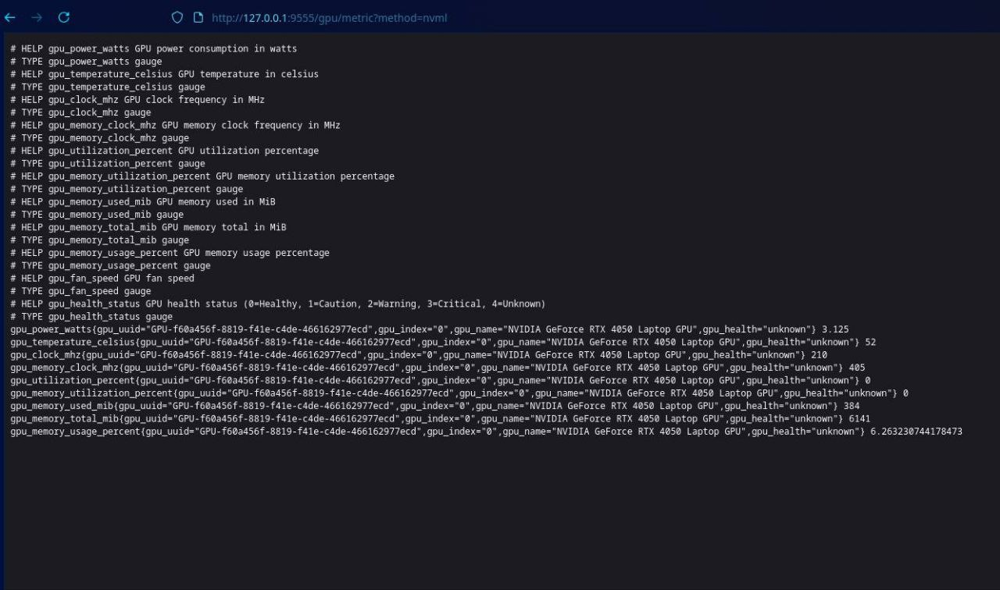

# پروژه شمارهٔ ۹ درس معماری کامپیوتر - سامانهٔ پایش منابع GPU

**ترم بهار ۱۴۰۴ - دکتر حسین اسدی**

**اعضای گروه**: امیرحسین محمدزاده، مهبد خالتی، امیرمهدی طهماسبی، مهدیار مستشار

**مسئول پروژه:** جناب آقای صداقت‌گو

---

## مقدمه

در این پروژه، هدف طراحی یک سامانهٔ هوشمند پایش (Monitoring) منابعِ کارت‌های گرافیکی (GPU - Graphical Processor Unit) بوده است که اهداف زیر را دنبال می‌کند:

- قابلیت **استخراج** Metric ها از سیستم (مانند GPU Utilization, Memory Usage, Temperature, Fan Speed و ...)
- قابلیت **ثبت** منظم داده‌های Metric در یک ساختار داده / پایگاه داده برای تحلیل‌های بعدی
- قابلیت **نمایش** لحظه‌ای و منظم وضعیت کارت/کارت‌های گرافیک 
  - تحت پنل وبی (Grafana)
  - تحت ترمینال (curses)
  - تحت دسکتاپ (‌pyside6)
- قابلیت **هشدار**؛ داخل پنل وبی و موارد مربوطه؛ و نیز **ارسال ایمیل** در صورت مداومت وضعیت مخاطره‌آمیز برای بیش از مدت مشخص
- ساختار مقیاس‌پذیر و قابلیت استفاده از راه دور 
- قابلیت پشتیبانی از چند GPU در یک سیستم

برای دستیابی به این اهداف، از یک ساختار منعطف و بر پایهٔ معماری میکروسرویس استفاده شد و همچنین تا حد ممکن از Docker استفاده شد. به‌طور خلاصه، این برنامه دارای یک هستهٔ استخراج‌کنندهٔ داده‌هاست (که بر اساس روش‌های مختلف `nvml` و `simulation` و نیز `bash` (که در واقع استفاده ترکیبی از `nvidia-smi` و `dcgmi` می‌باشد) داده را استخراج می‌کند)؛ و در کنار آن یک API Server که استفاده از داده‌های استخراج‌شده را به‌روش API Call ممکن می‌سازد. این معماری، برای فراهم‌آوردن امکان استفاده از راه دور، و نیز امکان استفاده از کانتینرهای docker برای بالاآوردن بخش‌های مختلف ابزار، لازم است.

## معماری پروژه 


معماری پروژه را در تصویر بالا مشاهده می‌کنید. همانطور که می‌بینید، پروژه از چند بخش اصلی تشکیل شده است:

- **بخش هستهٔ مرکزی** که در دایرکتوری `core/` فایل‌های آن را می‌بینید. با استفاده از دو فایل پایتون `core.py` (هستهٔ مرکزی با خروجی json برای استخراج داده‌های پایش با سه روش متفاوت) و `core_api.py` (سرور `FastAPI` شامل چند Endpoint برای استفاده از هستهٔ مرکزی به‌وسیلهٔ REST API) هندل می‌شود.
- **بخش مانیتورینگ و ثبت (Log) داده‌ها** که در دایرکتوری `logging-monitoring/` قرار دارد. این بخش، شامل سرویس Prometheus (برای جمع‌آوری خودکار داده‌ها و ثبت در داده‌ساختارهای Time-serie based و همچنین بررسی Rule ها و ...) و هندل‌کردن هشدارها توسط Alertmanager (ارسال ایمیل) و نیز یک کد ساده برای ثبت داده‌ها با فواصل زمان منظم در SQLite می‌باشد. البته نیازی به وجود آن نبود چون عملاً این‌کار را خود Prometheus انجام می‌دهد؛ ولی این را نیز پیاده کردیم که تجربهٔ ایجاد دستی فایلِ `.db` را نیز داشته باشیم (که با اسکریپت `csv_exporter.py` می‌توان خروجی csv نیز گرفت).
- **داشبورد Grafana** برای اتصال به Prometheus و مشاهده لحظه‌ای وضعیت و نیز لاگ‌های پیشین.
- **داشبورد تحت ترمینال** که بر پایهٔ کتابخانهٔ `curses` استوار است.
- **داشبورد گرافیکی دسکتاپ** که با استفاده از کتابخانهٔ `pyside6` پیاده‌سازی شده‌است.

## هسته مرکزی و API آن

### نحوه‌ی عملکرد کلی هستهٔ مرکزی پایتون

در این پروژه، یک هسته مرکزی طراحی و توسعه یافته است که وظیفه‌ی اصلی آن جمع‌آوری و ارائه‌ی اطلاعات مربوط به کارت‌های گرافیک (GPU) موجود در دستگاه host می‌باشد. این سامانه به گونه‌ای طراحی شده که در هر محیطی، صرف‌نظر از نوع و تعداد GPU های موجود، قابل اجرا باشد و بتواند خروجی استاندارد و ساختاریافته‌ای تولید کند.

این هسته به صورت تحت ترمینال قابل اجرا است و بسته به آرگومان‌هایی که از سوی کاربر دریافت می‌کند، (args) یکی از سه روش ممکن برای جمع‌آوری اطلاعات را انتخاب می‌کند. سپس اطلاعات را به صورت کامل جمع آوری می کند و در نهایت، خروجی برنامه یک فایل JSON واحد است که اطلاعات مرتبط با GPU ها را به شکل قابل پردازش ارائه می‌دهد.

حال این سه روش به شرح زیر هستند:

#### روش اول: استفاده از کتابخانه‌ی NVML

کتابخانه‌ی NVML (NVIDIA Management Library) یک API رسمی ارائه‌شده توسط شرکت NVIDIA است که امکان دسترسی به اطلاعات داخلی GPU را در اختیار برنامه نویسان قرار می‌دهد. این روش تنها زمانی میتواند استفاده می‌شود که کتابخانه‌ی NVML به‌درستی در سیستم نصب شده باشد. توجه کنید که این روش بیشترین دقت و جامع‌ترین داده‌ها را در اختیار می‌گذارد، زیرا مستقیماً با درایور GPU در ارتباط است. مگر در بخش هایی که DCGM اطلاعات بیشتری در اختیار ما میگذارد.

#### روش دوم: استفاده از ابزارهای خط فرمان (Bash)

در این روش، برنامه بدون استفاده از هیچ‌گونه کتابخانه‌ی سطح بالا مانند NVML عمل می‌کند. در عوض، اطلاعات از طریق ابزارهای موجود در محیط ترمینال لینوکس استخراج می‌شوند. مثل nvidia-smi یا DCGM.

#### روش سوم: شبیه‌سازی کامل اطلاعات GPU

در این روش، هیچ‌گونه وابستگی به سخت‌افزار واقعی وجود ندارد. تمامی اطلاعات به‌صورت مصنوعی و با استفاده از داده‌های تولیدشده به شکل تصادفی ساخته می‌شوند. در این روش فرض می شود که دستگاه 3 عدد GPU دراد و اطلاعات هر کدام به نمایش گذاشته می شود.


### پیاده‌سازی رابط API برای هسته

از آن‌جایی که لازم بود برای بعضی از کارها (از جمله استفاده از پرومتئوس، داکرایز کردن برخی سرویس‌ها و نیز امکان اتصال از راه دور)، یک سرور HTTP وجود داشته باشد که امکان دسترسی به داده‌های هستهٔ مرکزی را از طریق REST API فراهم کند.

برای این منظور، از فریمورک `FastAPI` استفاده شده است. این API شامل چندین endpoint اصلی است:

- **`/gpu/list`**: لیست کردن تمامی GPU های موجود در سیستم همراه با اطلاعات static آن‌ها
- **`/gpu/metric`**: ارائه‌ی داده‌های dynamic (قابل تغییر در زمان) به فرمت Prometheus برای استفاده در سیستم‌های monitoring
- **`/gpu/{gpu_uuid}`**: دریافت تمامی اطلاعات یک GPU مشخص بر اساس UUID آن
- **`/gpu/{gpu_uuid}/static`**: دریافت اطلاعات ثابت یک GPU مشخص
- **`/gpu/{gpu_uuid}/{key_path}`**: دسترسی به فیلدهای تو در تو یک GPU با استفاده از path

تمامی این endpoint ها از پارامتر `method` پشتیبانی می‌کنند که می‌تواند یکی از مقادیر `nvml`، `bash` یا `sim` باشد.

#### ویژگی‌های خاص endpoint متریک‌ها

endpoint مربوط به `/gpu/metric` به‌گونه‌ای طراحی شده که خروجی آن مستقیماً قابل استفاده توسط Prometheus باشد. این endpoint شامل:

- **متریک‌های عملکردی**: مصرف برق، دما، فرکانس کلاک، درصد استفاده
- **متریک‌های حافظه**: حافظهٔ استفاده‌شده، حافظهٔ کل، درصد استفاده از حافظه
- **متریک‌های سلامت**: وضعیت کلی سلامت GPU با مقادیر عددی (0=سالم، 1=احتیاط، 2=هشدار، 3=بحرانی)
- **لیبل‌های پیشرفته**: شامل UUID، نام GPU، شاخص و وضعیت سلامت به‌عنوان لیبل‌های Prometheus



## سرویس پایش، ثبت و هشدار

### استفاده از Prometheus

Prometheus به‌عنوان سیستم اصلی جمع‌آوری و ذخیره‌سازی متریک‌ها در این پروژه استفاده شده است. این سرویس به‌طور مستقل در یک کانتینر Docker اجرا می‌شود و به‌طور منظم از endpoint متریک‌های API Server داده جمع‌آوری می‌کند.

**تنظیمات Prometheus:**
- فایل کانفیگ: `prometheus/prometheus.yml`
- بازهٔ جمع‌آوری داده: هر 15 ثانیه یک‌بار
- هدف اصلی: `http://host.docker.internal:9555/gpu/metric`
- نگهداری داده‌ها: به‌مدت 15 روز

### تنظیم rule ها و کانفیگ alertmanager

برای تشخیص وضعیت‌های غیرعادی و ارسال هشدار، سیستم Alertmanager پیکربندی شده است که شامل:

**قوانین هشدار:**
- **دمای بالا**: هشدار در صورت بالا رفتن دمای GPU از 80 درجه
- **استفادهٔ بالای حافظه**: هشدار در صورت استفاده بیش از 90% حافظه GPU
- **مصرف برق غیرعادی**: هشدار در صورت تغییرات ناگهانی مصرف برق
- **وضعیت سلامت**: هشدار در صورت تغییر وضعیت سلامت به غیر از "سالم"

**تنظیمات Alertmanager:**
- ارسال ایمیل در صورت تداوم هشدار بیش از 5 دقیقه
- گروه‌بندی هشدارها بر اساس نوع GPU
- تنظیم سطوح مختلف severity (info, warning, critical)


### اسکریپت پایش دستی و ذخیره در Sqlite DB

علاوه بر Prometheus، اسکریپت جداگانه‌ای نیز برای ثبت داده‌ها در پایگاه داده SQLite پیاده‌سازی شده است. این اسکریپت:

- به‌طور منظم (هر دقیقه) از API Server داده دریافت می‌کند
- داده‌ها را در فایل SQLite محلی ذخیره می‌کند
- امکان export به فرمت CSV را فراهم می‌کند
- برای محیط‌هایی که نیاز به backup محلی دارند مفید است

## روش‌های نمایش و بررسی اطلاعات

### پنل وبی گرافانا (Grafana)

در کنار رابط کاربری ترمینالی که برای رصد لحظه‌ای طراحی شده بود، نیاز به یک پنل نظارتی تحت وب، جامع و با قابلیت‌های بصری‌سازی پیشرفته نیز احساس می‌شد. برای این منظور، از پلتفرم گرافانا (Grafana) در این پروژه استفاده شد.

گرافانا یک ابزار متن‌باز قدرتمند برای تحلیل و بصری‌سازی داده‌ها در بازه‌های زمانی مختلف است. این پلتفرم به ما اجازه می‌دهد تا به منابع داده‌ی متنوعی (در این پروژه، Prometheus که متریک‌های GPU را در اختیار ما قرار می‌داد) متصل شویم و داشبوردهای تعاملی و زنده‌ای را برای نظارت بر عملکرد سیستم‌ها ایجاد کنیم. مزیت اصلی گرافانا، قابلیت ساخت نمودارهای غنی، تنظیم هشدار (Alerting) و به اشتراک‌گذاری آسان داشبوردها است.

ما از گرافانا برای ایجاد داشبوردهای گرافیکی به‌منظور رصد معیارهایی همچون فرکانس پردازنده، سرعت فن، میزان استفاده از GPU و حافظه‌ی مصرفی استفاده کردیم. برای اطمینان از قابلیت بازتولید (Reproducibility) و مدیریت آسان تنظیمات، تمامی داشبوردها و پیکربندی‌های مربوط به آن‌ها از طریق فایل‌های JSON تعریف شدند. این رویکرد به ما اجازه داد تا ساختار داشبوردها را در کنار کدهای دیگر پروژه مدیریت کرده و به‌سادگی آن‌ها را بر روی سرورهای مختلف مستقر کنیم.

یکی از چالش‌هایی که در هنگام پیاده‌سازی با آن مواجه شدیم، نمایش تکراری اطلاعات مربوط به یک GPU واحد در نمودارها بود. این مشکل زمانی رخ می‌داد که Prometheus به دلایلی یک سری زمانی (Time Series) را برای یک GPU خاص، بیش از یک بار گزارش می‌کرد.

برای حل این مشکل، از قابلیت‌های زبان پرس‌وجوی Prometheus یعنی PromQL بهره بردیم. راه‌حل ما استفاده از تابع `sum()` به همراه عبارت `by` بود:

```promql
sum by (gpu_name, instance, gpu_uuid) (metric_name)
```

این عبارت به Prometheus دستور می‌دهد که:

1. مقادیر یک متریک مشخص (`metric_name`) را جمع کند.
2. اما این جمع‌بندی را بر اساس گروه‌بندی با برچسب‌های منحصر به فرد `gpu_name`، `instance` و `gpu_uuid` انجام دهد.

از آنجایی که هر کارت گرافیک فیزیکی دارای شناسه‌های `gpu_name` و `gpu_uuid` یکتا است، این دستورالعمل عملاً باعث می‌شود که تمام ورودی‌های تکراری برای یک GPU با هم ادغام شده و تنها یک سری زمانی صحیح و واحد برای هر GPU در نمودار نمایش داده شود. این کار دقت و خوانایی داشبوردها را به شکل چشمگیری افزایش داد.


### نرم‌افزار پایتون تحت دسکتاپ (فریمورک pyside6)

این برنامه یک ابزار دسکتاپی برای پایش و نظارت بر وضعیت پردازنده‌های گرافیکی (GPU) سیستم است که با استفاده از کتابخانه‌ی **PySide6** طراحی و پیاده‌سازی شده‌است. برنامه از دو تم ظاهری **روشن** و **تاریک** پشتیبانی می‌کند.

#### صفحه‌ی اصلی (Home)

در صفحه‌ی اصلی برنامه، کاربر ابتدا باید یک لینک وارد کند. این لینک باید به داده‌هایی اشاره داشته باشد که به‌صورت ساختاریافته و قابل فهم برای برنامه (مانند داده‌های متریک یا وضعیت GPU)، قابل دریافت باشند. برنامه از ابزار `requests` برای دریافت این اطلاعات استفاده می‌کند.

پس از بارگذاری داده‌ها، فهرستی از کارت‌های گرافیک موجود در سیستم نمایش داده می‌شود. هر GPU در قالب یک کارت (Card) نمایش می‌یابد که شامل موارد زیر است:

- **نام کارت گرافیک** (مثلاً NVIDIA RTX 3080)
- **UUID**
- **وضعیت سلامت**:
  - حالت معمولی برای وضعیت عادی
  - زرد برای هشدار
  - قرمز برای وضعیت خطرناک
- **دکمه‌ای برای ورود به صفحه‌ی جزئیات آن GPU**

#### صفحه‌ی جزئیات GPU

با کلیک روی هر GPU، صفحه‌ی اختصاصی آن نمایش داده می‌شود. در این صفحه، اطلاعات متغیر و لحظه‌ای کارت گرافیک شامل موارد زیر ارائه می‌گردد:

- دمای GPU
- سرعت فن
- میزان حافظه‌ی در حال استفاده
- درصد بار پردازشی
- فرکانس کاری GPU

اطلاعات به‌صورت لحظه‌ای به‌روزرسانی می‌شوند. از منوی کناری موجود در این صفحه، کاربر می‌تواند نمودارهای موردنظر را انتخاب کرده و روند تغییرات آن‌ها را در طول زمان مشاهده کند. نمودارها با استفاده از کتابخانه‌ی گرافیکی **matplotlib** طراحی شده‌اند.


#### ویژگی‌های کلیدی

- **پشتیبانی از تم‌های روشن و تاریک**: کاربر می‌تواند تم موردنظر خود را از تنظیمات انتخاب کند.
- **رابط کاربری واکنش‌گرا**: طراحی شده برای نمایش اطلاعات به‌صورت خوانا و کاربرپسند.
- **به‌روزرسانی لحظه‌ای**: داده‌ها به‌صورت خودکار از API دریافت و نمایش داده می‌شوند.
- **نمودارهای تعاملی**: امکان مشاهده‌ی روند تغییرات متریک‌ها در بازه‌های زمانی مختلف.
- **پشتیبانی از چند GPU**: نمایش اطلاعات تمامی کارت‌های گرافیک موجود در سیستم.

این ابزار دسکتاپی، تجربه‌ای ساده و کارآمد برای نظارت بر GPU ها فراهم می‌کند و مناسب برای کاربران حرفه‌ای و مدیران سیستم است.


### داشبورد TUI تحت ترمینال (بر پایهٔ curses)

برای پایش لحظه‌ای وضعیت کارت‌های گرافیک از راه دور، یک رابط کاربری ترمینالی (TUI) طراحی و پیاده‌سازی شده است که به‌صورت زنده داده‌های GPU را دریافت و نمایش می‌دهد.

اطلاعات مربوط به وضعیت GPU ها از طریق API مبتنی بر استاندارد Prometheus metrics دریافت می‌شود. با استفاده از کتابخانه‌ی `requests` در پایتون، داده‌ها از این API دریافت شده و سپس با استفاده از عبارات منظم (regex) استخراج و ساختاردهی می‌شوند. این داده‌ها شامل متریک‌هایی مانند دما، توان مصرفی، درصد مصرف حافظه، فرکانس پردازنده‌ی گرافیکی، وضعیت سلامت و میزان استفاده‌ی کلی از GPU هستند.

برای نمایش داده‌ها در محیط ترمینال، از کتابخانه‌ی `curses` استفاده شده است. این کتابخانه امکان ایجاد رابط‌های گرافیکی در محیط متنی را فراهم می‌کند. با بهره‌گیری از رنگ‌بندی، ساختار‌بندی مناسب خطوط و پنجره‌ها، و به‌روزرسانی‌های زمان‌مند، رابط کاربری طراحی‌شده اطلاعات را به شکلی خوانا و واکنش‌گرا نمایش می‌دهد.

برای نمایش روند تغییرات میزان استفاده از GPU، از یک گراف زنده به کمک کاراکترهای یونیکد استفاده شده است. تاریخچه‌ی کوتاهی از مقادیر اخیر مصرف GPU در ساختار `deque` نگهداری شده و در هر بروزرسانی، گراف کوچکی از روند مصرف به‌صورت لحظه‌ای نمایش داده می‌شود.

علاوه بر نمای استاندارد که یک دید کلی و سریع از وضعیت GPU ها ارائه می‌دهد، یک نمای دقیق (Detailed View) نیز برای تحلیل‌های عمیق‌تر پیاده‌سازی شده است. کاربر می‌تواند با فشردن کلید 'o' بین این دو حالت جابجا شود.

ویژگی کلیدی نمای دقیق، استفاده از نمودارهای با وضوح بالا است که با بهره‌گیری از کاراکترهای بریل یونیکد (Unicode Braille characters) در محیط ترمینال رسم می‌شوند. این تکنیک امکان نمایش تاریخچه‌ی مصرف GPU را با جزئیات بسیار بیشتری نسبت به گراف‌های ساده‌ی نمای استاندارد فراهم می‌کند.

در نمای دقیق، هر نمودار به یک GPU اختصاص داده شده و اطلاعات تکمیلی مانند فرکانس پردازنده و حافظه (Mem Clock/Clock)، توان مصرفی دقیق (Power Watts) و لیستی از فرایندهای در حال اجرا (Processes) به همراه PID و حافظه‌ی مصرفی آن‌ها نمایش داده می‌شود.


- **عدم وابستگی به رابط گرافیکی**: قابل اجرا در محیط‌های فاقد GUI مانند سرورهای لینوکسی یا اتصال SSH
- **منابع سبک**: بدون نیاز به ابزارهای سنگین
- **انعطاف‌پذیری**: دو حالت نمایش برای رصد سریع و عیب‌یابی دقیق
- **نمایش بصری پیشرفته**: استفاده از کاراکترهای یونیکد برای نمودارهای با کیفیت


این زیرسیستم ابزاری کارآمد و انعطاف‌پذیر برای مدیران سیستم و کاربران پیشرفته فراهم کرده که امکان نظارت دقیق و مؤثر بر عملکرد GPU ها را در محیط‌های مختلف ممکن می‌سازد.

## بررسی ابزار DCGM

### معرفی DCGM

DCGM یا "مدیر GPU دیتاسنتر" یک ابزار از شرکت NVIDIA است که برای مدیریت و مانیتور کردن کارت‌های گرافیک در دیتاسنتر طراحی شده است. با استفاده از DCGM می‌شود اطلاعات مختلفی مثل دمای GPU، مصرف برق، سرعت کلاک، میزان استفاده از حافظه و خطاهای سخت‌افزاری را به‌صورت لحظه‌ای یا تاریخی بررسی کرد.

**مزایای DCGM:**

- **مانیتورینگ پیشرفته**: دسترسی به متریک‌های تخصصی و دقیق‌تر از nvidia-smi
- **تست‌های سلامتی**: قابلیت اجرای تست‌های جامع سخت‌افزاری
- **یکپارچگی**: امکان اتصال به سیستم‌های مانیتورینگ مثل Prometheus
- **مناسب برای کلاستر**: طراحی‌شده برای محیط‌هایی با چندین GPU
- **تشخیص زودهنگام**: کمک به شناسایی مشکلات سخت‌افزاری قبل از بروز خرابی

این ابزار مخصوصاً در محیط‌هایی که چندین GPU دارند مثل سیستم‌های هوش مصنوعی یا کلاسترهای پردازش سنگین کاربرد دارد.

### مشکلات کار با DCGM

در طول توسعهٔ این پروژه، با چالش‌های متعددی در استفاده از DCGM مواجه شدیم:

**مشکل اصلی - سازگاری با توزیع‌های Linux:**

چالش اصلی ما این بود که این ابزار به‌طور ویژه برای Ubuntu یا Debian طراحی شده است و راه‌اندازی آن در Arch Linux سخت و دشوار بود. حتی در 4 ماه پیش این کار به‌کلی غیرممکن بوده است.

**سایر مشکلات:**

- **پیچیدگی نصب**: نیاز به تنظیمات پیچیده درایور و CUDA toolkit
- **وابستگی‌های متعدد**: نیاز به نصب کتابخانه‌های مختلف با ورژن‌های خاص
- **دسترسی‌های سیستمی**: نیاز به privileged access برای عملکرد صحیح

### استفاده از DCGM

با وجود مشکلات فوق، در نهایت به کمک کامپایل کردن کد سورس و استفاده از snap این مشکل رفع شد و برنامه با موفقیت اجرا شد. اما همچنان نیز گاهی دچار ایراداتی است.


در این پروژه، دلیل اصلی استفاده از DCGM، لاگ کردن و بررسی سلامت دستگاه است. به‌طور ویژه بررسی سلامت در بخش bash method استفاده می‌شود.

**نحوه استفاده:**

```bash
# دریافت اطلاعات کلی GPU ها
dcgmi discovery -l

# نظارت بر متریک‌های خاص برای سلامت
dcgmi health --list

# ترکیب با nvidia-smi برای اطلاعات کامل
nvidia-smi && dcgmi health --list
```

**رویکرد ترکیبی:**

برای دستیابی به بهترین نتایج، از ترکیب nvidia-smi و dcgmi استفاده شده:

- nvidia-smi برای اطلاعات پایه و سریع
- dcgmi برای بررسی سلامت و متریک‌های تخصصی
- ادغام خروجی هر دو ابزار در یک JSON واحد

## جمع‌بندی

این پروژه یک سیستم کامل نظارت بر GPU های NVIDIA ارائه می‌دهد که شامل:

### ویژگی‌های اصلی

- **سه روش جمع‌آوری داده**: NVML، Bash (nvidia-smi/dcgmi)، Simulation
- **API RESTful**: دسترسی از راه دور با FastAPI
- **نظارت خودکار**: Prometheus + Alertmanager برای هشدارها
- **رابط‌های متنوع**: Grafana (وب)، PySide6 (دسکتاپ)، Curses (ترمینال)

### نوآوری‌ها

- **سیستم سلامت**: ارزیابی وضعیت کلی GPU (سالم/احتیاط/هشدار/بحرانی)
- **معماری میکروسرویس**: Docker containerization و مقیاس‌پذیری
- **متریک‌های پیشرفته**: لیبل‌های Prometheus شامل نام GPU و وضعیت سلامت

### کاربردها

مناسب برای مراکز داده، محیط‌های تحقیقاتی، gaming/رندرینگ و cryptocurrency mining.

### نتیجه

پیاده‌سازی موفق معماری میکروسرویس با ترکیب Python، FastAPI، Prometheus، Grafana و Docker که امکان نظارت جامع و قابل اعتماد بر GPU ها را فراهم می‌کند. تجربهٔ کار با DCGM و مشکلات آن، درس‌های مهمی در انتخاب ابزار مناسب ارائه داد.


